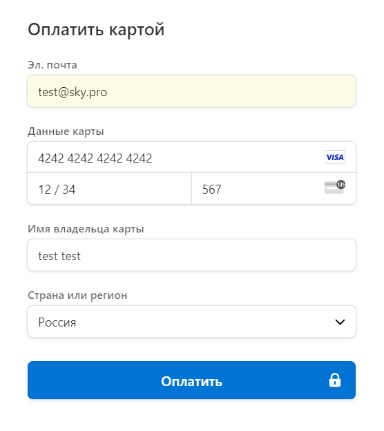

# Blog_Journal

# OB2

### Задача

Реализовать платформу для публикации записей пользователями. Публикация может быть бесплатной, то есть доступной любому пользователю без регистрации, либо платной, которая доступна только авторизованным пользователям, который оплатили разовую подписку. Для реализации оплаты подписки используйте Stripe. Регистрация пользователя должна быть по номеру телефона.

### Дополнительные ссылки

- [Stripe](https://stripe.com/docs/api)

### Требуемый стэк

- python
- postgresql
- django
- docker

### Условия приемки

- код размещен в открытом репозитории
- код покрыт тестами минимум на 75%
- код оформлен согласно pep8
- оформлен Readme файл

## Для запуска проекта необходимо:
1. Клонируйте репозиторий.
2. Создайте и активируйте виртуальное окружение.
3. Для работы программы необходимо установить зависимости, указанные в файле requirements.txt pip install -r requirements.txt (показано для (venv)).
4. Создайте файл .env. Введите туда свои настройки как указано в файле .env.sample.

## Запуск проекта с помощью Docker Compose
Для запуска проекта с помощью Docker Compose выполните следующие шаги:

1. Установите Docker и Docker Compose, если они еще не установлены на вашем компьютере.
2. Соберите и запустите контейнеры Docker.
2.1 docker-compose build
2.2 docker-compose up
2.3 docker-compose exec app python  manage.py csu
2.4 docker-compose exec app python manage.py loaddata fixtures/users.json 
2.5 docker-compose exec app python manage.py loaddata fixtures/blog.json  
3. Откройте браузер и перейдите по адресу http://localhost:8001 для доступа к проекту.

### Полезные команды:

Сборка образов: docker-compose build

Запуск контейнеров: docker-compose up

Запуск контейнеров в фоне: docker-compose up -d

Сборка образа и запуск в фоне после успешной сборки: docker-compose up -d —build

Выполнение команды внутри контейнера app: docker-compose exec app <здесь ваша команда>

Остановка контейнеров: docker-compose stop

Удаление контейнеров: docker-compose down

Проверка в shelle всех запущенных и остановленных контейнеров: docker ps -a

Ссылка на тестовые карточки для stripe:
https://docs.stripe.com/terminal/references/testing#standard-test-cards

